===========================================================================================
**Assessing the relative importance of forests for wind erosion control using QGIS V 2.18**
===========================================================================================
  
|image200|
|image0|

The UN-REDD Programme is the United Nations Collaborative initiative on
Reducing Emissions from Deforestation and forest Degradation (REDD) in
developing countries. The Programme was launched in September 2008 to
assist developing countries prepare and implement national REDD+
strategies, and builds on the convening power and expertise of the Food
and Agriculture Organization of the United Nations (FAO), the United
Nations Development Programme (UNDP) and the United Nations Environment
Programme (UNEP).

The United Nations Environment Programme World Conservation Monitoring
Centre (UNEP-WCMC) is the specialist biodiversity assessment centre of
the United Nations Environment Programme (UNEP), the world’s foremost
intergovernmental environmental organisation.  The Centre has been in
operation for over 30 years, combining scientific research with
practical policy advice.

**Prepared by Xavier de Lamo, Yara Shennan-Farpón and Corinna
Ravilious.**

**Copyright:** 2019 United Nations Environment Programme

**Copyright release:** This publication may be reproduced for
educational or non-profit purposes without special permission, provided
acknowledgement to the source is made. Re-use of any figures is subject
to permission from the original rights holders. No use of this
publication may be made for resale or any other commercial purpose
without permission in writing from UNEP. Applications for permission,
with a statement of purpose and extent of reproduction, should be sent
to the Director, UNEP-WCMC, 219 Huntingdon Road, Cambridge, CB3 0DL, UK.

**Disclaimer:** The contents of this report do not necessarily reflect
the views or policies of UNEP, contributory organisations or editors.
The designations employed and the presentations of material in this
report do not imply the expression of any opinion whatsoever on the part
of UNEP or contributory organisations, editors or publishers concerning
the legal status of any country, territory, city area or its
authorities, or concerning the delimitation of its frontiers or
boundaries or the designation of its name, frontiers or boundaries. The
mention of a commercial entity or product in this publication does not
imply endorsement by UNEP.

We welcome comments on any errors or issues. Should readers wish to
comment on this document, they are encouraged to get in touch via:
ccb@unep-wcmc.org.

**Citation:** de Lamo, X. Shennan-Farpón, Y. and Ravilious, C. (2019)
Step-by-step tutorial v1.0: Calculating the relative importance of
forest for wind erosion control - QGIS v2.18. Prepared on behalf of the
UN-REDD Programme. UN Environment World Conservation Monitoring Centre,
Cambridge, UK.

**Acknowledgements:** These training materials have been produced from
materials generated for working sessions held in various countries to
aid the production of multiple benefits maps to inform REDD+ planning
and safeguards policies using open source GIS software.

|image201|                                                    |image1|

------------
Introduction
------------

REDD+ has the potential to deliver multiple benefits beyond carbon. For
example, it can promote biodiversity conservation and secure ecosystem
services from forests such as water regulation and non-timber forest
products. Some of the potential benefits from REDD+, such as
biodiversity conservation, can be enhanced through identifying areas
where REDD+ actions might have the greatest impact using spatial
analysis.

Open Source GIS software can be used to undertake spatial analysis of
datasets of relevance to multiple benefits and environmental safeguards
for REDD+. Open-source software is released under a license that allow
software to be freely used, modified, and shared
(http://opensource.org/licenses). Therefore, using open source software
has great potential in building sustainable capacity and critical mass
of experts with limited financial resources.

The capacity of forest to control soil erosion is also regarded as a key
potential REDD+ benefit. Wind erosion, in particular, constitutes a key
component in soil degradation processes in arid areas; as it can cause
degradation of sedimentation crusts on the surface of stripped soils, as
well as reducing the capacity of soils to store nutrients and water (FAO
1996). Even though the importance of the contributing factors are
locally dependent, it is widely recognized that the amount of soil loss
by wind erosion at a regional scale is mainly dependent on four key
factors: climate, soil, topography and vegetation cover (Shao & Leslie
1997).

This tutorial provides a methodology to conduct a preliminary spatial
assessment of the relative importance of forest in protecting against
wind erosion by mapping these key factors, using Paraguay as a study
area. The analysis is undertaken by using an overlay approach, where
data on wind speed, precipitation, evapotranspiration, soil
characteristics and topographical complexity are generated and combined
with forest data. The method described here is partly based on the
USDA’s Universal Wind Erosion Equation (Wooddruf & Siddoway, 1965), as
well as on Mezosi *et al.* (2015), Tsogtbaarar & Khudulmur (2014), and
FAO (1979).

This method is not designed to predict exact locations of wind erosion
occurrence or making quantitative estimates of potential soil erosion –
it serves to assess the role of forests to wind erosion control based on
the general sensitivity of the land to wind erosion, taking into account
the dominant/general climate, soil and topographical conditions of the
area. The resulting map may be suitable for regional land use management
and identify wind erosion-prone areas, where more detailed quantitative
risk mapping may be needed.

The analysis runs entirely from QGIS version 2.18, R Software and R
Studio, which needs to be installed in order to execute this analysis.

-----------
Methodology
-----------

The first step will be to prepare, download and process all the
necessary layers in order to have the required variables to estimate the
relative importance of forest for wind erosion control. Using the
formula from Woodruff and Siddoway (1965) as a starting point, we have
designed and adapted a formula which uses an overlay approach to
calculate the importance of forest for wind erosion control at a
regional scale as a function of 4 thematic layers’ parameters:

**Climate:** Wind speed and humidity are the main climatic controlling
factors. It is generally assumed that wind speed at values above 6 – 9
m/s wind erosion occurs (Mezosi *et al.* 2015)\ **.** Similarly, the
sensitivity to wind erosion increase with aridity, as humid soil
particles are more resistant to be displaced by wind (Shao & Leslie
1997).

**Soil characteristics:** Texture and gran size distribution are assumed
to determine soil erosion sensitivity. Coarse-textured soils, such as
sandy soils, are known to be more prone to wind erosion than
fine-textured ones, such as clay soils (Fryrear *et al.* 1998).

**Topography:** The more “rough” the surface is, the lower is the wind
speed, and hence the wind erodibility will decrease (Shao 2008).

**Vegetation cover:** Vegetation acts as a protection layer that
prevents the wind to displace soil particles. The density of the
vegetation determines the level of protection.

The method described in this document goes through the steps required to
develop the spatial layers for the first three factors listed above. A
final map showing the relative importance of forest for wind erosion
control, is produced by combining all the layers developed. This method
assumes that the user has a forest cover layer available for analysis,
which is utilized in this tutorial as a substitute of the vegetation
cover.

Below an image showing the workflow including the steps required to
carry out this analysis.

|image2|

1. .. rubric:: Prepare the climate, soil characteristics and topography
      layers.
      :name: prepare-the-climate-soil-characteristics-and-topography-layers.

2. .. rubric:: Create the Climate factor (C’) layer
      :name: create-the-climate-factor-c-layer

Climate erosivity is assessed in this method using the formula suggested
by FAO (1979) for the Universal Wind Erosion Equation (Wooddruf &
Sidoway, 1965):

.. math:: C = \frac{1}{100}\  \times \ \sum_{i = 1}^{12}{u^{3}\left( \frac{PETi - Pi}{\text{PETi}} \right)}d

Where:

*u* = monthly average wind speed (m/s)

*PETi* = monthly potential evaporation (mm)

*Pi* = monthly average precipitation (mm)

*d* = the number of days in a month.

Spatial layers will be developed for each parameter included in the
equation above, and will then be used as input layers in Raster
Calculator to produce a climate erosivity map.

~~~~~~~~~~~~~~~~~~~~~~~~~~~~~~~~~~~~~~~~~~~~~~~~~~~~~~~~~~~~~~~~~~~~~~
Compute the monthly average wind speed layer (u)
~~~~~~~~~~~~~~~~~~~~~~~~~~~~~~~~~~~~~~~~~~~~~~~~~~~~~~~~~~~~~~~~~~~~~~

Twelve layers, representing monthly average wind speed values for the
area of interest, will be developed for the *“u”* component of the
formula. If no spatial modelled surface for wind velocity are available
for your study area, you can develop one using daily wind speed station
data from `NOAA's National Climatic Data Center
website <https://www.climate.gov/data/maps-and-data>`__. This data will
be used in this tutorial to create average wind speed maps for each
month of the year in the study area, by using geostatistical methods in
QGIS and statistical analyses in RStudio.

**Steps to download the daily wind speed data**

1. Go to: https://www.climate.gov/maps-data, and then click on to
   ***Dataset Gallery*** on the top of the page\ ***.***

2. On the left side of the page, under ***Refine by Coverage***, click
   on ***Global*** and then search for ***Daily Weather Statistics
   (Graph or Data table).***

|image3|

1. *Go to **Data Access ***\ and click on the link under ***Daily
   Observational Data*** in the ***Subsetting Service Row. ***

|image4|

1. A pop up window will open, click on **All Maps** and then on **Daily
   Observational Data.** A map viewer will automatically open.

2. Once the map viewer is open, **Search** for a location, Paraguay in
   this case, and tick the box next to **Global Summary of the Day** on
   the left side of the map.

|image5|

1. Click on the **tools** **icon** next to **Global Summary of the Day**
   and then to **Polygon** to select the area of interest. This will
   allow you to draw a polygon and select the weather stations for your
   area of interest. For a more accurate execution of the interpolation
   that will be carried out later on, it is advised to also select
   weather station in the surrounding area of our area of interest. In
   this example, we will draw a polygon around Paraguay.

   |image6|

2. On the left side of the map the list of the stations included in the
   polygon will appear. Select just the stations with at least *five
   years of data* and then click on **Access Data** at the bottom.

|image7|

In the following window, click on ***“Agree”***.

1. In the next window, you will be asked to select the date range of the
   weather records of the station selected. Select 01/01/1949 and leave
   the date in the “To” row as it is. Select ***“comma delimited”***
   under ***“Select output format”.*** Mark the box under “I am not a
   robot” and then click continue.

|image8|

1. The dataset of the records selected will then available for download
   as a csv. Click on the link to the text file and select ***“Save link
   as”*** and save it in your working file (“data\_downloaded.txt”).

|image9|

**Steps to compute historical monthly wind speed averages from the daily wind speed data**

Now that we have downloaded all the required data, we need to compute
historical monthly wind speed averages from it. We will use R Software
and R Studio (an R user interface) to do this.

1. Open **R Studio** and set your working directory by going to
   **Session > Set Working Directory > Choose Directory.** Select the
   folder in which you have saved the weather data.

|image10|

1. Now we are going to import the weather dataset file,
   “data\_downloaded.txt”. Under the ‘Environment’ tab in R studio
   window, click on ***“Import Dataset”*** and select **“From Text
   (base)”**

|image11|

1. Select the dataset and ensure that the “\ ***Separator***\ ” is set
   as *“Comma”,* “\ ***Decimal***\ ” is set as *“Period”* and
   ***“na.strings”*** to *“999.9”*, which is the value to which our
   dataset assigns the missing values. Then click ***“Import”*.** You
   can change the name of the dataset to something easier to work with
   (for example, WS).

|image12|

    You are now able to see the dataset in the viewer window. We are now
    going to select from the dataset our parameters of interest: the
    Station Code Number (“STN…”), the date of the observations
    (“YEARMODA”) and the mean wind speed value (“WDSP”).

1. Change the name of the station name column (STN…) to something
   simpler to work with (fnamWSor example: STN). To do that, write the
   following formula in the console window:

   |image13|

|image14|

1. Now, we are going to create a new data frame (WS1) containing only
   the three variables of interest (STN, YEARMODA and WDSP). To do that,
   write the following command in the console.

|image15|

You should now see the following datasets (WS and WS1) in the Global
Environment tab:

|image16|

1. For computational purposes, the variable for the date of the
   observation (*YEARMODA*) must be split into three: year, month and
   day of observation. To do this, write the following formula into the
   Console window:

|image17|

|image18|

    Right click on the **WS1** data frame in **RStudio’s data window**
    to see the changes made in the data frame.

|image19|

The WS1 dataset now shows the new variables created, YEAR, MONTH and
DAY:

|image20|

1. The WS dataset contains some no data values (recorded as 999.9). We
   need to remove these values from the dataset before any other
   calculation is made. A new data frame will be created (WS2),
   containing only valid observations. To do that, write the following
   command in the console:

|image21|

    Note that you can now see WS2 in the Data window. The number of
    observations (obs.) included in WS2 has been reduced compared to
    WS1.

|image22|

1. In the ‘metadata’ txt file downloaded in Step 8 of the section “Steps
   to download the daily wind speed data”, you will see that wind speed
   values are in tenths of a knot (0.1 knots). The formula requires
   these values to be converted to meters per second (m/s). To convert
   these values to m/s and store them in a new column called ‘WDSP\_MS’,
   write the following command in the console:

|image23|

    In the WS2 data tab you can now see a new column ‘WDSP\_MS’ with new
    values for wind speed in m/s:

|image24|

    We can now compute mean monthly wind speed values for each of the
    stations of the dataset.

**Steps to compute mean monthly wind speed values**

1. We will carry out this operation using a **dplyr** package, which is
   not included in the core R software. To install and load the
   **dplyr** package, write the following formula in the Console tab:

   |image25|

    The download process will start automatically. Once the process is
    finished, you should see the text below in the Console window:

package ‘assertthat’ successfully unpacked and MD5 sums checked

package ‘R6’ successfully unpacked and MD5 sums checked

package ‘Rcpp’ successfully unpacked and MD5 sums checked

package ‘magrittr’ successfully unpacked and MD5 sums checked

package ‘lazyeval’ successfully unpacked and MD5 sums checked

package ‘DBI’ successfully unpacked and MD5 sums checked

package ‘BH’ successfully unpacked and MD5 sums checked

package ‘dplyr’ successfully unpacked and MD5 sums checked

The downloaded binary packages are in

C:\\Users\\yaras\\AppData\\Local\\Temp\\RtmpQV1ak4\\downloaded\_packages

This will also show you the directory of the downloaded package on your
computer.

|image26|

1. Once the package is loaded, write the following command in the
   console:

|image27|

    This will calculate monthly average wind speed for each of the
    weather stations in the data frame and store the values in a new
    data frame called WS3. The new data frame will then look like this.
    In order to see the WS3 data frame, click on WS3 in the Global
    Environments window:

|image28|

**Add the geographical coordinates of the weather stations into the dataset**

We now have the average wind speed values we were looking for, but
before exporting the dataset we need to add further information in order
to be able to perform the interpolation in QGIS. First, we need to add
the geographical coordinates of each station. To do that, follow these
steps:

1. Download the coordinate system data from this link:
   http://www1.ncdc.noaa.gov/pub/data/noaa/

    This website will provide access to many datasets and folders
    grouped into different years. Select the file called
    ‘isd\_history.csv’ (or click here to download the data directly:
    http://www1.ncdc.noaa.gov/pub/data/noaa/isd-history.csv). The data
    is downloaded as a .csv file, comma delimited, which can be opened
    and viewed in R or Excel.

1. Open the csv data set, and save it as a text file, e.g.
   ‘isd.history-merge.txt’.

2. In R, use the Import button to import the txt file. Use the
   parameters as shown in the image below:

|image29|

You should now see the data in the data viewing window (top left), like
this:

|image30|

1. The station coordinate file (‘isd.history-merge.txt’) containing
   information of each station (its name, the country where is located
   and the geographic coordinates LAT and LONG) has now to be merged
   with the data frame containing information on mean\_wdsp. R will use
   the station code, STN, as the union element from the ‘WS3’ data frame
   and the station code USAF from the ‘isd.history-merge.txt’ data
   frame. In order to perform this step write in the console window the
   command shown below:

> WS4<-merge(WS3,isd.history\_merge,by.x=”STN”,by.y=“USAF”,all=FALSE)

    This will create a new data frame, WS4, using the Station Code as a
    common key variable. The new dataset will look something similar to
    this:

|image31|

1. To facilitate the steps of the analysis performed with QGIS, we now
   need to split the dataset into one file for each month. To do that,
   write the following commands in the console:

|image32|

|image33|

Finally, export the datasets created through the following commands:

|image34|

    This will create a separate csv file for each of the months, which
    will also be saved in the workspace directory folder.

|image35|

**Develop continuous mean monthly wind speed surfaces for the study area** 

To develop a final climate layer covering the whole area of interest, is
now necessary to estimate the average wind speed for the zones where
weather stations are missing. To perform this analyses, we need to
interpolate wind speed values for all the study area using
geostatistical techniques. The preliminary step requires to import all
the datasets exported in the previous step and convert them into point
shapefiles using QGIS.

**Follow the steps below, repeating them for every file of monthly wind
speeds. At the end of the process you will have 12 separate files:**

1. Select **‘Layer’ > ‘Add Layer’ > ‘Add delimited text layer’**, as
   shown below:

|image36|

    Select the parameters, using the CSV format (change the input layer
    name for each monthly dataset, e.g. “Mean\_WS\_Jan”,
    “Mean\_WS\_Feb”, etc.) as shown in the image below, and then click
    OK:

|image37|

1. A Coordinate Reference System Selector will appear asking you to
   select a coordinate reference system. Since the wind speed
   coordinates are in latitudes and longitudes, you should select WGS
   84. Click OK.

You should now have the point data loaded in QGIS, as in the image
below:

|image38|

1. The layers need now to be projected into a projected coordinate
   system. Right click on each layer and select “Save As…” a window will
   automatically appear. Select the folder to which you want to save the
   file, give it a name and select an appropriate projected coordinate
   system for your study area, in this case we will select WGS 84 UTM
   Zone 21S. Repeat for all twelve layers.

|image39|

|image40|

1. We are now going to apply the Universal Kriging technique to
   interpolate the monthly mean wind speed values. This particular
   technique has been chosen since is considered one of the most
   accurate techniques to spatially interpolate this kind of variable
   (Luo *et al.* 2007). To perform this analysis go to the processing
   toolbox and search for SAGA’s Universal Kriging tool. Right click and
   select “Execute as batch process”.

|image41|

1. This action will open a new window, insert each one of the projected
   point shapefiles produced in the prior step. In **Attribute**, select
   the name of the column that contain the monthly mean wind speed
   values. In the **Resampling** column, choose “Inverse Distance
   Interpolation”. In **Search Range**, choose “global”. In **Number of
   Points,** select “All points within search distance”. In **Cell
   Size**, select 1000. Finally, in the **Prediction and Quality
   Measures** columns specify the folder in which you want to save the
   output files and give each file a name. Leave the other parameters as
   they are. (**TIP**: you can automatically fill the columns with the
   value of the first row by double clicking the head of the column).
   Then click **Run**.

   |image42|

2. The layer you are interested in is the Prediction one, the second
   layer generated (Quality measures) just provides you with statistics
   on how well the prediction has been made. Interpolation does not give
   accurate results outside the collection area, so let’s clip the
   resulting surfaces with the study area boundary. To do that, we need
   to load a shapefile of the area of interest. Click on **‘Layer’ >
   ‘Add Layer’ > ‘Add Vector Layer’.**

   |image43|

3. Go to \ **Processing -> Toolbox** and search for **Clip raster by
   mask layer.** Rick click and select **“Execute as a batch process”.**
   In the **Input layer** column, select each of the recently created
   wind speed raster layers, in consecutive order. In the **Mask layer**
   column, select the shapefile of your study area. Then, select the
   folder and name of the 12 clipped layers in the **Clipped (mask)**
   column. Select “\ **Yes”** under **“Crop the extent of the target
   dataset to the extent of the cutline”** and leave the other
   parameters as they are. Once done, click **Run**. The interpolated
   data will now be cut to the region of interest:

   |image44|

~~~~~~~~~~~~~~~~~~~~~~~~~~~~~~~~~~~~~~~~~~~~~~~~~~~~~~~~
Extract Potential Evapotranspiration (*PETi*) data 
~~~~~~~~~~~~~~~~~~~~~~~~~~~~~~~~~~~~~~~~~~~~~~~~~~~~~~~~

    To be able to make the calculation as per the initial formula for
    climate erosivity (see Page 2), we need monthly potential
    evaporation data *PETi* (mm).

1. PET data can be downloaded from the `CGIAR-CSI Global PET
   Database. <https://figshare.com/articles/Global_Aridity_Index_and_Potential_Evapotranspiration_ET0_Climate_Database_v2/7504448/3>`__

|image45|

1. Select the “global\_et0\_monthly.tif.zip” to download and save in
   your working folder. Unzip the files.

2. Open the 12 raster files in QGIS. Select the 12 tif files (the number
   corresponds to the month).

|image46|

1. Once all PET files are open, we need to clip them to the study area
   border. Open a shapefile of the study area and ensure that it is in
   the same projection as the PET layers (EPGS 4326). To do that go to
   **Processing -> Toolbox** and search for **Clip raster by mask
   layer**. Right click on it and select **Execute as batch process.**

|image47|

1. In the **Input layer** column, select each of the PET raster layers,
   in consecutive order. In the **mask layer** column, select the
   shapefile of your study area. Then, select the folder and name of the
   12 clipped layers in the **Clipped (mask)** column. Leave the rest as
   it is. Once done, click **Run**.

|image48|

1. QGIS will automatically clip the twelve PET layers to the shape of
   your study area and save the resulting files in the folder that you
   specified. The result will be something similar to this:

|image49|

~~~~~~~~~~~~~~~~~~~~~~~~~~~~~~~~~~~~~~~~~~~~~~~~~~~~~~~~~~~~~~~~~~~~~~
Extract monthly average precipitation (*Pi*) for your study area
~~~~~~~~~~~~~~~~~~~~~~~~~~~~~~~~~~~~~~~~~~~~~~~~~~~~~~~~~~~~~~~~~~~~~~

    The climate erosivity formula also requires monthly average
    precipitation (*Pi*) values. If a gridded precipitation layer is not
    available for your study area, it is possible to extract this data
    from a global dataset, called WorldClim, following the steps
    described below:

1. Go to WorldClim (`www.worldclim.org <http://www.worldclim.org>`__),
   click **Version 2.0. **

|image50|

1. This will take you to the download page for climate data at different
   resolutions. Click on the relative link to download raster data for
   precipitation at the required resolution, in this example, we will
   select the 30 sec resolution.

|image51|

    The download of a zip file including precipitation layers for each
    month of the year, numbered 1 to 12, will start.

1. Unzip these files, upload them in QGIS and clip them to the shape of
   your study area following the same steps described in the previous
   section.

~~~~~~~~~~~~~~~~~~~~~~~~~~~~~~~~~~~~~~~~~~~~~~~~~~~~~~~~~~~~~~~~~~~~~~
Use Raster Calculator to compute the climatic ‘C’ factor layer
~~~~~~~~~~~~~~~~~~~~~~~~~~~~~~~~~~~~~~~~~~~~~~~~~~~~~~~~~~~~~~~~~~~~~~

    Now that we have all the required variables, we can calculate the C
    factor as per the initial formula using Raster Calculator in QGIS:

.. math:: C = \frac{1}{100}\  \times \ \sum_{i = 1}^{12}{u^{3}\left( \frac{PETi - Pi}{\text{PETi}} \right)}d

    The 3 sets of monthly layers (windspeed, precipitation and
    EvapoTranspiration) prepared in the previous steps will be used as
    input layers in Raster Calculator.

    To perform the analysis follow the instructions below:

1. Open the 3 set of layers in QGIS. Ensure that they all have the same
   extent, resolution and are in the same projection.

2. Open the Raster Calculator tool in QGIS, clicking on ‘Raster’ ‘Raster
   Calculator’.

3. Write the formula in the raster calculator expression, following the
   example below. Call the output layer “C\_factor” and saved it in your
   working folder.

((("ws\_1@1"^3) \* (( "pet\_1@1" - "prec\_1@1") / "pet\_1@1")\*31) +
(("ws\_2@1"^3) \* (( "pet\_2@1" - "prec\_2@1") / "pet\_2@1")\*28) +
(("ws\_3@1"^3) \* (( "pet\_3@1" - "prec\_3@1") / "pet\_3@1")\*31) +
(("ws\_4@1"^3) \* (( "pet\_4@1" - "prec\_4@1") / "pet\_4@1")\*30) +
(("ws\_5@1"^3) \* (( "pet\_5@1" - "prec\_5@1") / "pet\_5@1")\*31) +
(("ws\_6@1"^3) \* (( "pet\_6@1" - "prec\_6@1") / "pet\_6@1")\*30) +
(("ws\_7@1"^3) \* (( "pet\_7@1" - "prec\_7@1") / "pet\_7@1")\*31) +
(("ws\_8@1"^3) \* (( "pet\_8@1" - "prec\_8@1") / "pet\_8@1")\*31) +
(("ws\_9@1"^3) \* (( "pet\_9@1" - "prec\_9@1") / "pet\_9@1")\*30) +
(("ws\_10@1"^3) \* (( "pet\_10@1" - "prec\_10@1") / "pet\_10@1")\*31) +
(("ws\_11@1"^3) \* (( "pet\_11@1" - "prec\_11@1") / "pet\_11@1")\*30) +
(("ws\_12@1"^3) \* (( "pet\_12@1" - "prec\_12@1") / "pet\_12@1")\*31)) /
100

1. |image52|\ The resulting map will look similar to the one shown on
   the side. The higher the value is (in dark orange), the higher is
   expected to be the climatic tendency to produce conditions conducive
   to wind erosion.

~~~~~~~~~~~~~~~~~~~~~~~~~~~~~~~~~~~~~~~~~~~~~~~~~~~~~~~~~~~~~~~~~~~~~~
Re-classify the ‘C’ factor layer into classes for analysis 
~~~~~~~~~~~~~~~~~~~~~~~~~~~~~~~~~~~~~~~~~~~~~~~~~~~~~~~~~~~~~~~~~~~~~~

    Finally, we need to reclassify the C factor layer into classes, so
    as to be able to perform the final function which will produce a
    layer with different classes of wind erosion sensitivity.

First, we will compute the interval classes that will be utilised to
reclassify the C factor layer:

1. In the processing toolbox, open the **r.quantile** tool. This tool
   computes quantiles (intervals that contains equal number of features)
   in a dataset. In **Input raster layer** select the recently created
   C\_factor layer. In **Number of quantiles**, enter “7”. Thick on
   Generate recode values based on quantile-defined intervals. Finally
   in **Quantiles (raw output)** specify the path where to save the
   output file.

   |image53|

2. There are various reclassification tools in QGIS. We will use the
   **r.reclass** tool, which requires a text file (.txt) where the user
   defines the rules for reclassification. To prepare the
   reclassification rule text file, open the text file created in the
   previous step and use the intervals to specify the classes, as shown
   in the image below:

|image54|

    \* Always ensure to reclassify values in ascending rank, the
    interval containing the highest values is reclassified to “7”, the
    second one to “6”, and so on.

When done, save the file as C\_factor\_reclass\_rule.txt

1. Now open the **r.reclass** tool. In **Input Raster** window, enter
   the C\_factor raster file and in **File containing reclass rules**,
   select the reclass rule text file created in the previous step
   (C\_factor\_reclass\_rule.txt). Click **Run**. The output file would
   be similar to the one below.

   |image55|\ |image56|

**Create the soil wind erodibility (I) layer**

Soil wind erodibility is directly related to the percentage of soil
aggregates larger than 0.84 mm in diameter. Based on this indicator, the
US Department of Agriculture (USDA), classified the soils into 7 soil
wind erodibility classes, based on soil texture and soil carbonate
content (CaCO:sub:`3`). The classification goes from 1 (highly
susceptible to wind erosion) to 7 (no susceptible to wind erosion).

|image57|

In order to create the soil wind erodibility layer, you would need a
soil map for the study area with information on soil texture and
carbonate content. This part of the tutorial will show you how to obtain
this data from the Harmonized World Soil Database (HWSDA). The HWSD is a
30 arc-second raster database that combines existing regional and
national updates of soil information worldwide.

1. Go to
   http://webarchive.iiasa.ac.at/Research/LUC/External-World-soil-database/HTML/index.html?sb=1
   and click on Download Data only.

|image58|

1. The HWSD includes a raster image file and a linked attribute
   database. In the next window, download the HWSD\_RASTER.zip and the
   HWSD.mbd files.

2. We now need to query the HWSD.mbd database in Microsoft Access to
   obtain the Soil texture values that will allow to determine to which
   Wind Erodibility Group they pertain. To do that, open the HWSD.mb in
   Microsoft Access.

3. Then, go to the tab **CREATE** and click on **QUERY DESIGN**

   |image59|

4. A new screen will automatically appear, in the table pick
   **HWSD\_DATA** and click on **Add**

5. The HWSD\_DATA table will appear in the workspace. A small panel will
   appear, double click in this order **MU\_GLOBAL**,
   **T\_USDA\_TEX\_CLASS**, **T\_CACO3** and **T\_CLAY**. These 4
   variables will be added in the table located at the bottom. Now click
   on the **Make Table** command.

|image60|\ |image61|

1. Give the table a name (for example WEG) and click OK. Then click on
   the **Run** button on the top bar.

|image62|

1. The new table will be created and will automatically appear in the
   table list at the left. Now, right click on it, select **Export** and
   then **Excel.** Save it in your working folder. When done, open the
   file in Microsoft Excel and save it in CSV format.

|image63|

1. Now, unzip HWSD\_RASTER.zip and upload hwsd.bil in QGIS. Convert it
   into Geotiff format by right clicking on the layer and selecting
   **Save As…**

|image64|

1. Upload a shapefile of your study area to cut out the hwsd.tiff file
   created in the previous step to the shape of your study area using
   GDAL’s **Clip Raster by mask layer tool.**

|image65|

1. Now, we need to convert the output raster file to a point shapefile
   in order to join it with the excel file created in Access before. To
   do that, go to the Processing Toolbox window and open the **Raster
   values to points** tool in Saga. In the **Grids** window, select the
   raster layer created in the previous step. In Type, select
   **“cells”.** In Shapes, specify the name of the **output** layer and
   then click **Run**.

   |image66|

2. When the process is finished, upload the output file in QGIS. Go to
   the processing toolbox and open the **Refactor fields** tool. This
   tool is useful to edit the structure attribute table of vector files.
   Change the name of the variable “clippedmask” to MU\_GLOBAL and click
   on **Run**.

3. Now open the csv file containing the USDA soil texture values
   (remember to have previously saved the Excel file exported from
   Access as csv file). To do that, go to **Layer > Add Layer > Add
   Delimited Text Layer.** In **Geometry Definition**, select **No
   Geometry** (**attribute only table).** Then, click OK.

|image67|

1. Now, right click on the point shapefile created in step 12 and go to
   **Properties**, and then **Joins.** Then click on the green “\ **+”**
   sign button.

|image68|

1. In the next window, select the text file WEG, as **Join layer**. In
   **Join field** (the common field between both datasets), select
   MU\_GLOBAL, and in **Target field** select MU\_GLOBAL again. Then,
   click **Choose which fields are joined** and select
   T\_USDA\_TEXT\_CLASS, T\_CACO3 and T\_CLAY. Save it under a new name
   and in a projected coordinate system.

   |image69|

2. Now the soil texture and carbonate data will be used to reclassify
   the map into the Wind Erodibility groups defined by the USDA. To do
   that you first need to know, how this information is codified in the
   database. This is explained in the database documentation (available
   at
   http://webarchive.iiasa.ac.at/Research/LUC/External-World-soil-database/HWSD_Documentation.pdf),
   and is the following:

    **T\_USDA\_TEX\_CLASS**: The values in this fields contains 13
    possible classes of soil texture, which are codified in the
    following way:

|image70|

    **T\_CACO3**: The values in this field represent % of weight. We
    will use this information to determine if a soil is calcareous or
    non-calcareous, which is a parameter needed to determine the
    corresponding wind erodibily group of some soil texture classes. For
    the purposes of this work, we will assume that all soils with more
    than 15% of CaCO3 are calcareous, as defined by the FAO (FAO 2016).

    To be consistent in the re-classification process through this
    methodology, we will consider 7 classes of soil wind erodibiliy in
    ascending order, from 1 (low susceptibility to wind erosion) to 7
    (high susceptibility to wind erosion), as we did in the C factor
    map; therefore inverting the classes described below (i.e. class 1
    ‘very fine sand, fine sand, sand, or coarse sand’ will become class
    7 for our analysis, as sandy soils are most sensitive to wind
    erosion).

+---------------+
| New classes   |
+===============+
| 7             |
+---------------+
| 6             |
+---------------+
| 5             |
+---------------+
| 4             |
+---------------+
| 4             |
+---------------+
| 3             |
+---------------+
| 2             |
+---------------+
| 1             |
+---------------+
| NA            |
+---------------+

    |image71|

    To do that, open the attribute table of the point shapefile created
    in the step 15 and click on **field calculator**. This tool allows
    to perform calculations on the basis of existing attributes values
    or functions.

|image72|

1. In the next window, click on **Create new field**. In the **Output
   field name** insert WEG.

   |image73|

2. In the Expression window, insert the text below. This function will
   automatically compute the corresponding WEG value based on the values
   of USDA texture classes, CaCO\ :sub:`3` and Clay content, as defined
   in the WEG table included in the previous page.

CASE WHEN "WEG\_T\_USDA\_TEX\_CLASS" = 13

THEN 7

WHEN "WEG\_T\_USDA\_TEX\_CLASS" = 12

THEN 6

WHEN "WEG\_T\_USDA\_TEX\_CLASS" = 11

THEN 5

WHEN "WEG\_T\_USDA\_TEX\_CLASS" = 10

THEN 3

WHEN "WEG\_T\_USDA\_TEX\_CLASS" = 9 AND "WEG\_T\_CACO3" > 15

THEN 4

WHEN "WEG\_T\_USDA\_TEX\_CLASS" = 9 AND "WEG\_T\_CACO3" < 15

THEN 3

WHEN "WEG\_T\_USDA\_TEX\_CLASS" = 8

THEN 3

WHEN "WEG\_T\_USDA\_TEX\_CLASS" = 7 AND "WEG\_T\_CLAY" < 20

THEN 3

WHEN "WEG\_T\_USDA\_TEX\_CLASS" = 7 AND "WEG\_T\_CLAY" > 20

THEN 2

WHEN "WEG\_T\_USDA\_TEX\_CLASS" = 6

THEN 1

WHEN "WEG\_T\_USDA\_TEX\_CLASS" = 5

THEN 4

WHEN "WEG\_T\_USDA\_TEX\_CLASS" = 4 AND "WEG\_T\_CLAY" > 35 AND
"WEG\_T\_CACO3" < 15

THEN 1

WHEN "WEG\_T\_USDA\_TEX\_CLASS" = 4 AND "WEG\_T\_CLAY" > 35 AND
"WEG\_T\_CACO3" > 15

THEN 4

WHEN "WEG\_T\_USDA\_TEX\_CLASS" = 4 AND "WEG\_T\_CLAY" < 35

THEN 4

WHEN "WEG\_T\_USDA\_TEX\_CLASS" = 3

THEN 4

WHEN "WEG\_T\_USDA\_TEX\_CLASS" = 2

THEN 4

WHEN "WEG\_T\_USDA\_TEX\_CLASS" = 1

THEN 4

END

    Then click **OK.** QGIS will create a column named “WEG” and
    automatically populate it following the criteria established in the
    code. This may take a few minutes. Then click **Save**.

1. Once the previous step is completed, we need to convert the point
   shapefile layer into a raster file again. The **Rasterize (vector to
   raster)** tool can be used to perform this step. In **Input layer**,
   select the projected point shapefile created in the previous step. In
   **Attribute field**, select the soil texture variable (WEG), then
   select an appropriate raster resolution for your study area. In our
   case, we will set it to 1000 x 1000 meters. Give the output file a
   name and click **Run.**

|image74|

You have just created a soil texture map for your study area, as it is
shown in the image below.

|image75|

    Note, in this analysis, there are only 6 classes because those are
    the soil types present in our study area, Paraguay.

**Create the Topography (K) layer**

The more “rough” the surface is, the lower is the wind speed, hence the
wind erodibility will decrease. To estimate surface roughness, a DEM
dataset can be used to compute the Terrain Ruggedness Index (TRI)
developed by `Riley *et al.*
(1999) <http://download.osgeo.org/qgis/doc/reference-docs/Terrain_Ruggedness_Index.pdf>`__.
This index computes the difference between the value of each cell and
the mean of an 8-cell neighbourhood of surrounding cells and classifies
its values in seven classes (from “level” to “extremely rugged”). To
create a Terrain Ruggedness Index map for your study area, follow the
steps described below:

1. Upload a DEM for your study area. If not available, go to
   http://www.hydrosheds.org/download select **Void-filled elevation**
   and then **Elevation 30 sec resolution GRID.** Then select the one
   that covers your study area (in the case of Paraguay, we will choose
   **sa\_dem\_30s\_grip.zip**

|image76|

1. This will download a zip file. You must store the file and extract
   all data (right click, then select **Extract All**\ …) in order to
   open the DEM data in QGIS.

2. Open QGIS and add the DEM data as a ‘raster layer’. To do this, click
   on **Layer** in the tools bar at the top of the document, then click
   **Add Layer** and select **Add Raster Layer…** from the drop-down
   menu.

3. You can then browse to the folder location where the DEM is saved.
   The DEM raster is located within the sa\_dem\_30s sub-folder. Within
   that folder, click on any of the files, and click **Open**.

|image77|

You will now have the DEM layer in your QGIS.

1. Clip the DEM to the shape of your study area, using GDAL’s **Clip
   Raster by mask layer** tool as done in previous steps\ **.**

2. To calculate the terrain ruggedness index, go to **Raster > Terrain
   Analysis > Ruggedness Index.**

|image78|

    Load the Raster Terrain Analysis plugin in the Plugin Manager. Go to
    **Raster > Terrain Analysis > Ruggedness Index**. Fill in the tool
    dialogue box as shown below and click OK:

|image79|

    You should now have a new raster layer with values within the index.
    In our case, the values range from 0 to 572.228

    |image80|

1. We now need to reclassify the final layer into 7 classes. We will use
   the classification suggested by Riley et al. (the authors of this
   index) and re-classify the layer into 7 classes, where 7 indicates
   low ruggedness index values, meaning a higher sensitivity to wind
   erosion.

   |image81|

(Source: https://planet.qgis.org/planet/tag/terrain%20analysis/)

    To reclassify the layer, open a text editor and create a reclass
    rule text file, using the as shown below:

    |image82|

    Then save the file with the name TRI-reclass.txt

1. Open the **r.reclass** tool to reclassify the Terrain Ruggedness
   Index into 7 classes.

    |image83|

You will obtain something similar to the image below:

|image84|

**Combine layers to produce wind erosion sensitivity map**

Now that we have all the layers we can perform the final analysis as per
the original formula. We will sum the C’ (climate), I’ (soil
erodibility) and K’ (soil roughness factor) factors using the **Raster
Calculator** tool to create a wind erosion sensitivity map.

First, ensure that the layers have all the same cell size, geographic
projection and layer extent. Go to Raster calculator and fill in the
parameters as shown in the image below.

|image85|

The final map should look similar to the one below.

|image86|

**Mask the wind erosion sensitivity map using the forest cover layer**

The forest cover layer will now be used to mask the previously created
wind erosion sensitivity map to understand where the forests play an
important role in controlling wind erosion. To do that, load the forest
cover layer in QGIS, and use the **Raster masking** tool to cut the wind
erosion sensitivity map to only show areas with forest cover.

1. Search **Raster masking** in the Processing toolbox, and open it. In
   **Grid**, enter the wind erosion sensitivity layer, in **Mask**,
   enter the forest cover layer and in **Masked Grid** enter the name
   and desired location of the output file. Then click **Run**.

    |image87|

    We have now created the final map, a layer that indicates the
    relative importance of forests to control wind erosion from 21
    (maximum importance) to 3 (minimum importance).

1. Now, right click on the layer and choose **Properties**. Then go to
   **Style. In Render Type,** select “Singleband pseudocolor”, select a
   color ramp that you like, in **Mode** select “Equal Interval”, in
   **classes** select “6” and then click **Apply**.

|image88|

    The resulting file indicates the relative importance of forest to
    control wind soil erosion in 6 classes, from Low to High.

|image89|

**REFERENCES**

Fryear, D. W. (1998). Mechanics, measurement and modelling wind erosion.
Advances in Geoecology 31: 291-300.

Food and Agriculture Organization of the United Nations (1979). A
Provisional Methodology for Soil Degradation Assessment. Rome: FAO,
61−63.

Food and Agriculture Organization of the United Nations (1991). Unasylva
- No. 164 - Watershed management. An international journal of the
forestry and food industries - Vol. 42 - 1991/1. Tenth World Forestry
Congress. ISSN 0041-6436. Palais des Congrès, 17-26 September 1991,
Paris.

Food and Agriculture Organization of the United Nations (1996) Land
husbandry – Components and strategy. Soil Resources Management and
Conservation Service Land and Water Development Division, FAO. Rome,
Italy. ISBN 92-5-103451-6

Food and Agriculture Organization of the United Nations (2016)
Management of calcareous soils. FAO Soils Portal. Available at:
http://www.fao.org/soils-portal/soil-management/management-of-some-problem-soils/calcareous-soils/en/

Luo, W., Taylor, M.C. and Parker, S. R. (2007) A comparison of spatial
interpolation methods to estimate continuous wind speed surfaces using
irregularly distributed data from England and Wales. *International
Journal of Climatology* 28: 947-959.

Mezősi, G., Blanka, V., Bata, T., Kovács, F., and Meyer, B (2015):
Estimation of regional differences in wind erosion sensitivity in
Hungary, *Nat. Hazards Earth Syst. Sci*., 15, 97-107

Riley, S. J., S. D. DeGloria and R. Elliot (1999). A terrain ruggedness
index that quantifies topographic heterogeneity\ *, Intermountain
Journal of Sciences*, vol. 5, No. 1-4. 

Shao, Y. and Leslie, L. M. (1997). Wind erosion prediction over the
Australian continent. *Journal of Geophysical Research – Atmospheres*
102: 20091-30105

Shao, Y. (2008). *Physics and modelling of wind erosio*\ n. Springer,
Cologne.

Tsogtbaarar, J. & Khudulmur, S. (2014) *Desertification Atlas of
Mongolia*. Institute of Geoecology, Mongolian Academy of Sciences. ISBN:
978-99973-0-197-0.

Woodruff, N.P. and Siddoway, F.H. (1965) A Wind Erosion Equation. *Soil
Science Society Proceedings,* 29, 602–608. Available from:
http://www.ars.usda.gov/SP2UserFiles/Place/30200525/897%20A%20wind%20erosion%20equation.pdf
   

.. |image0| image:: media/media_Wind_Erosion/image3.png
   :width: 3.214in
   :height: 2.194in
.. |image1| image:: media/media_Wind_Erosion/image4.png
   :width: 2.427in
   :height: 0.820in

.. |image3| image:: media/media_Wind_Erosion/image6.png
   :width: 6.26806in
   :height: 2.32431in

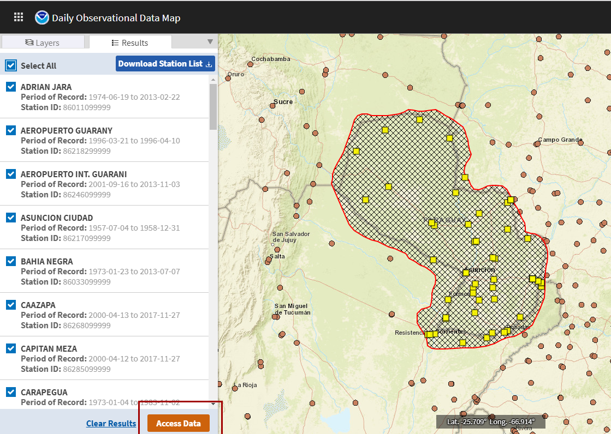

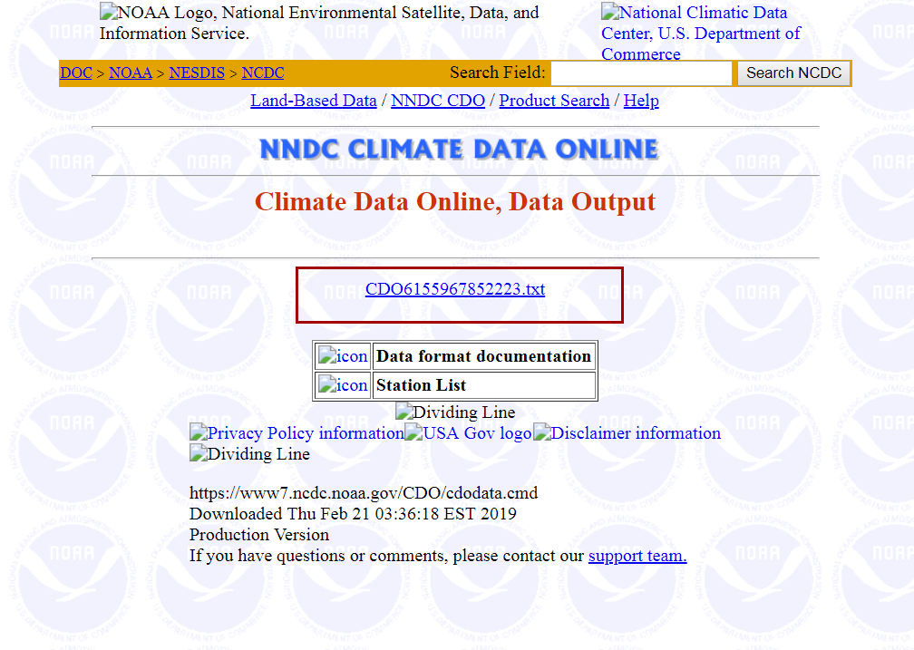
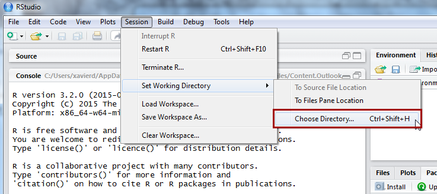

.. |image16| image:: media/media_Wind_Erosion/image21.png
   :width: 6.26806in
   :height: 1.48472in

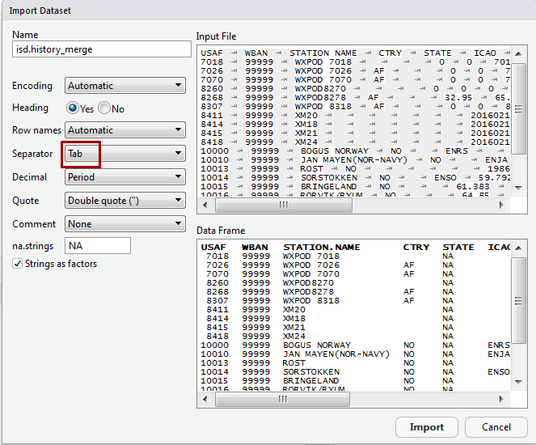

.. |image31| image:: media/media_Wind_Erosion/image36.png
   :width: 4.95409in
   :height: 1.96385in

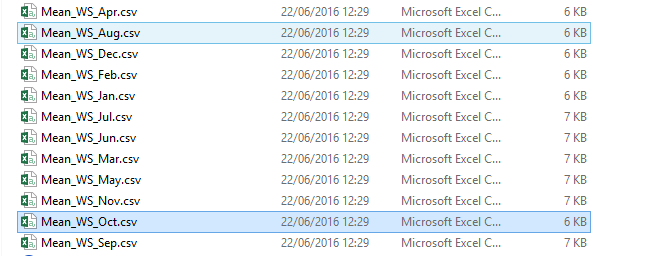

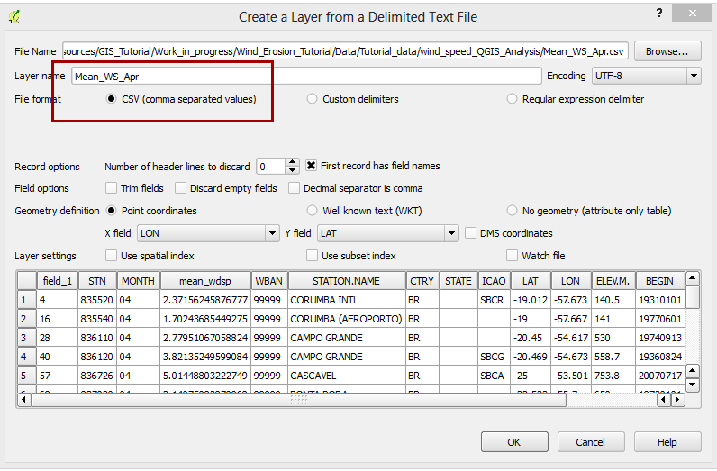

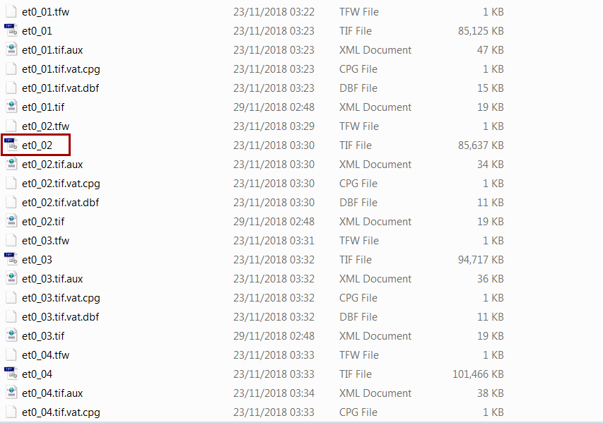

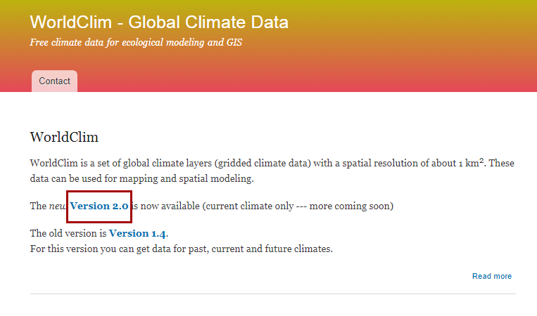
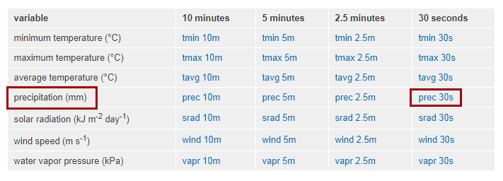

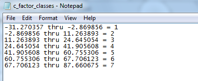

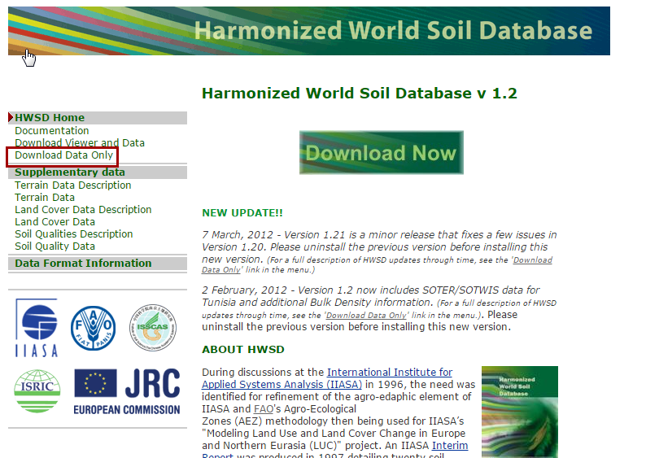

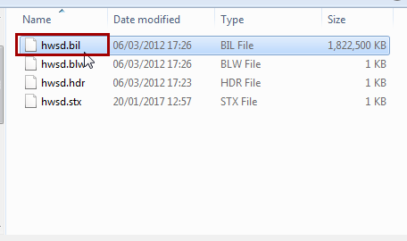

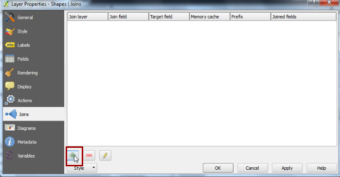

.. |image70| image:: media/media_Wind_Erosion/image75.png
   :width: 4.15652in
   :height: 2.01439in

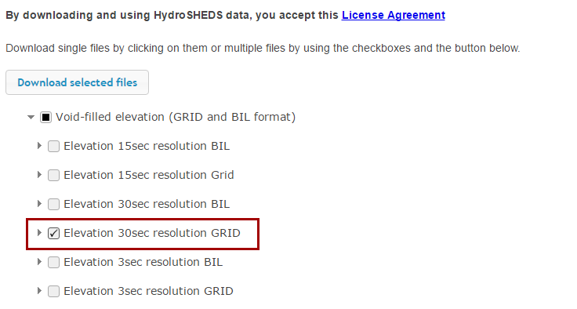
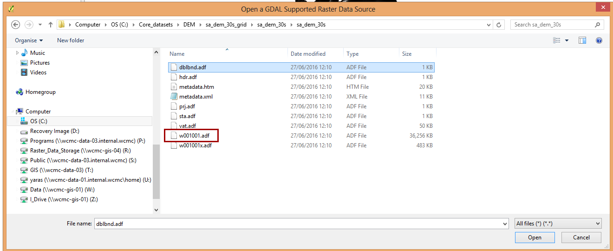

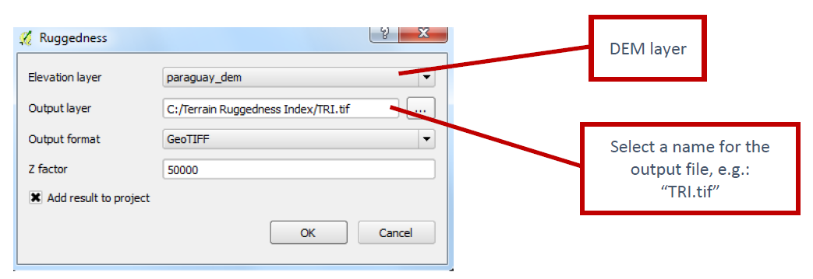
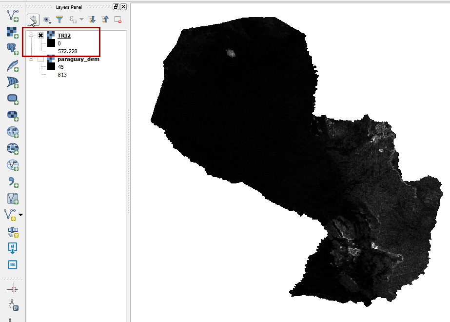

.. |image83| image:: media/media_Wind_Erosion/image87.png
   :width: 3.35294in
   :height: 2.68235in

